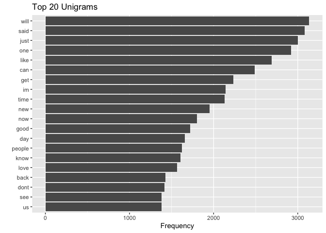
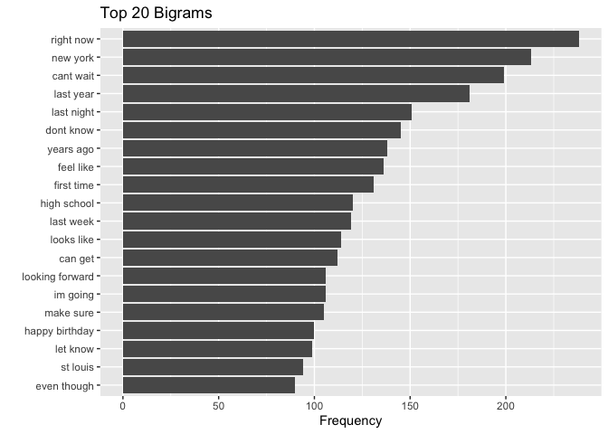
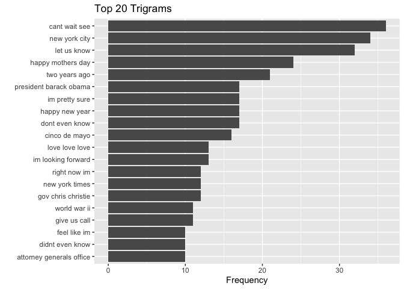

&nbsp;
&nbsp;


## 1. Introduction

This milestone project is used to illustrate the exploratory data analysis of the given SwiftKey dataset as a preparation of the Shiny App and algorithm of the Capstone Project.

&nbsp;
&nbsp;

## 2. Libraries Used

&nbsp;

The following libraries will be used:


```r
library(stringi)
library(tm)
library(RWeka)
library(ggplot2)
```

&nbsp;
&nbsp;


## 3. Data Preparation

The dataset will be downloaded from [SwiftKey](https://d396qusza40orc.cloudfront.net/dsscapstone/dataset/Coursera-SwiftKey.zip).
There are three data files included which are

- **en_US.blogs.txt**
- **en_US.news.txt**
- **en_US.twitter.txt** 


The summary of given files are as shown below:

```
##           file_name file_size_in_Mb lines_per_file words_per_file
## 1   en_US.blogs.txt        200.4242         899288       37570839
## 2    en_US.news.txt        196.2775        1010242       34494539
## 3 en_US.twitter.txt        159.3641        2360148       30451170
```

&nbsp;
&nbsp;

## 4. Data Cleaning

Since the size of data is huge, in order to reduce the processing time, a smaller dataset is considereed. Hence, only 1% of the number of lines per file will be extracted as samples for analysis. Samples of three given files will be combined into one sample dataset for cleaning and analysis. The number of lines of the sample sample dataset will be 


```
## [1] 42695
```

Then, the sample dataset will be converted into a corpus and the following characters or words will be will cleaned or transformed:

* Remove URL
* Remove Twitter Handler
* Remove Email Address
* Remove Profanity Words
* Transform all words to lowercase
* Remove English Stopwords
* Remove Numbers
* Remove Punctuation

**Credit: The Profanity Word List is downloaded from [Luis von Ahn's](https://www.cs.cmu.edu/~biglou/resources/) for corresponding profanity checking and removal.**


&nbsp;

The sample after cleaning will look like:


```r
my_corpus_df <- data.frame(text = unlist(sapply(my_corpus, '[', "content")), stringsAsFactors = FALSE)
head(my_corpus_df)
```

```
##                                                                                                                                            text
## 1  whats next  ales  autism  april  autism awareness month greg   couple events   works hes  ready  discuss yet      can  sure ill let  know   
## 2                                                                                                                  wouldnt  opened  anyone else
## 3                                                   finish   flourless chocolate cake ethereally light  fluffy   nightcap  pedro ximenez sherry
## 4                                                                                   ways people can verify  ’m saying  publicrecord information
## 5                                                                              youve grown older  interests  narrowed books dolls girlie things
## 6                                                                                                                                  india factor
```

&nbsp;
&nbsp;

## 5. Exploratory Data Analysis


&nbsp;
&nbsp;


### 5.1 Unigram

<!-- -->

&nbsp;
&nbsp;

### 5.2 Bigram

<!-- -->
&nbsp;
&nbsp;


### 5.3 Trigram

<!-- -->

&nbsp;
&nbsp;

## 6. Next Steps

&nbsp;
&nbsp;

